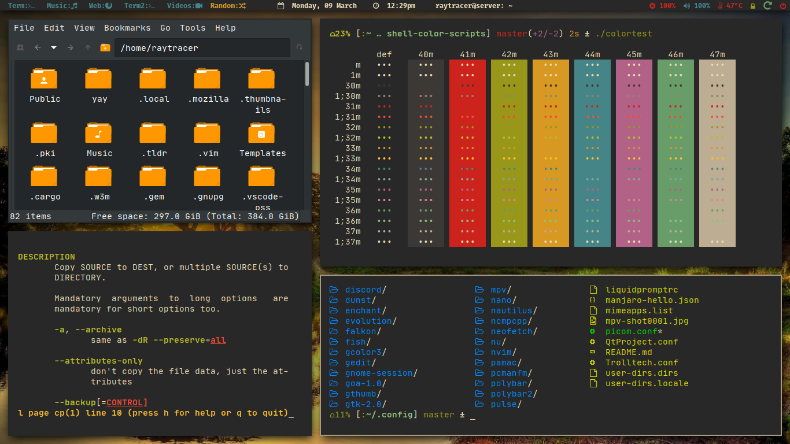
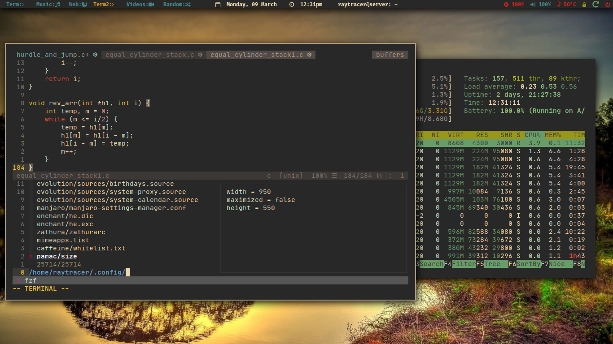
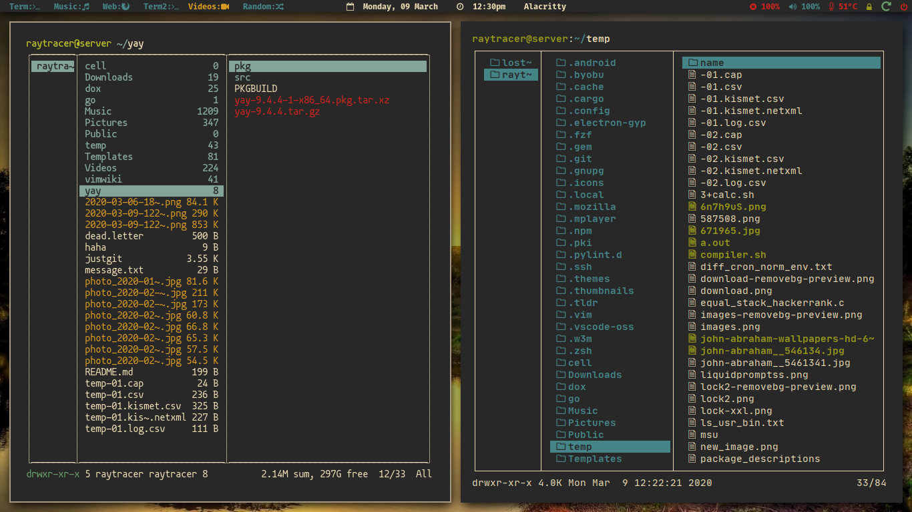
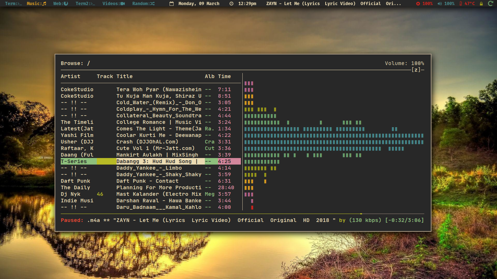
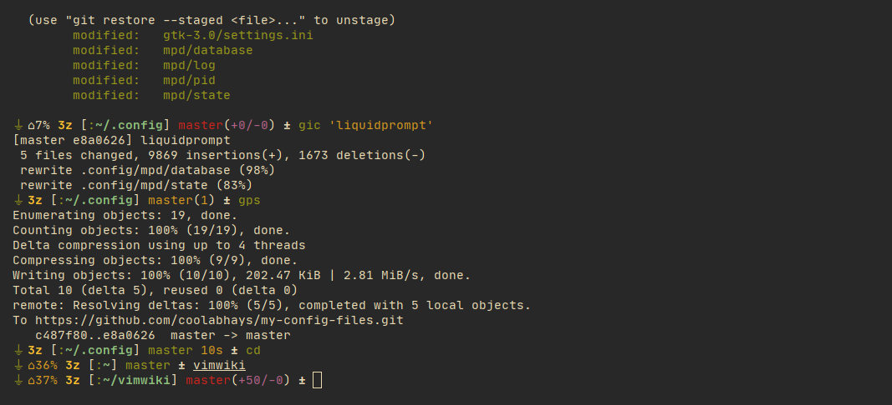

# Files and Folders

These are some of the config files and dot files which I use daily

## Current Prompt

I'm using `liquidprompt`, right now

`Window Manager: i3`

`N/vim look & design(text editor)`

`Terminal FileManager/s`

`Statusbar & Music player`

`Screenshot liquidprompt`

