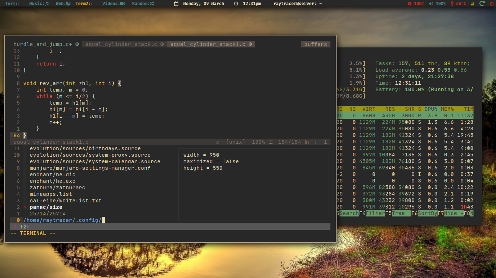

# Files and Folders

These are some of the config files and dot files which I use daily

All the `scripts` are in `~/.local/bin/.scripts`

## Window Manager
Using `i3wm` as my window manager

`Window Manager: i3`

## Text Editor
Using `Neovim` as my full time text editor

`N/vim look & design(text editor)`

## Terminal FileManagers
Using `ranger` and `lf` as terminal file managers

`Terminal FileManager/s`

## Music Player & Statusbar
Using `mpd(ncmpcpp)` and `cmus` as my music player and `Polybar` as statusbar

`Statusbar & Music player`

## Current Prompt
I'm using `liquidprompt`, right now

`Screenshot liquidprompt`

## Corona Update

