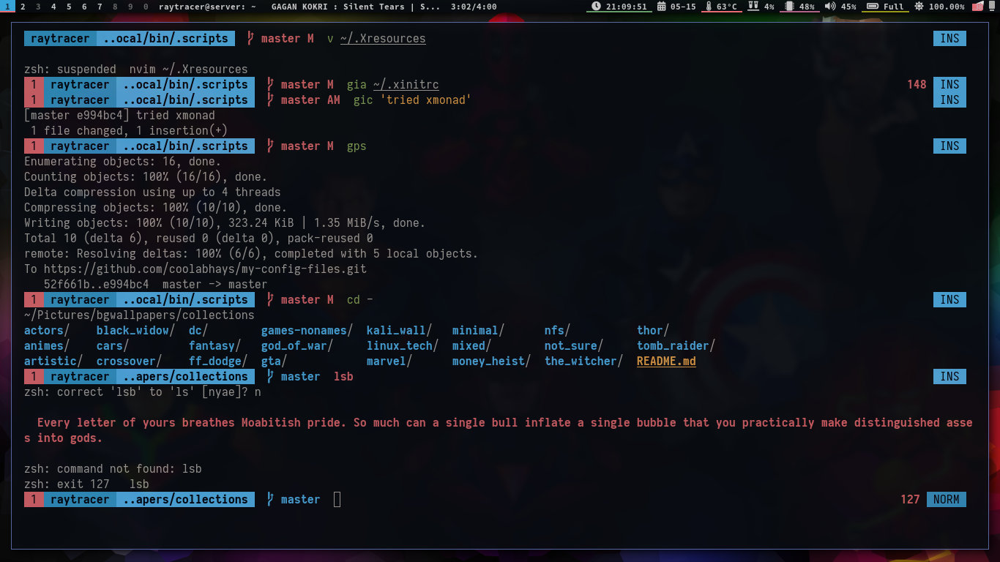

# Files and Folders

These are some of the config files and dot files which I use daily

All the `scripts` are in `~/.local/bin/.scripts`

## Window Manager

### dwm(current wm)
Currently using [dwm](https://dwm.suckless.org) as my primary window manager. You can find my [dwm_custom build](https://github.com/coolabhays/dwm_custom.git) here.

### bspwm(2021-01-18)
Currently using [bspwm](https://github.com/baskerville/bspwm) as my primary
window manager.

`Binary Space Partitioning Window Mangager(bspwm)` as name suggests, this is
a binary space partitioning tiling wm which supports _spiral,alternative_ and
some other partitioning mechanisms.

Also, `sxhkd` is a must with bspwm as it binds the keys to different commands.

### i3wm(2020-05-07)
Using `i3wm` as my window manager

`Window Manager: i3`

## Current Terminal Emulator

### Kitty(primary)

Currently, using [kitty](https://sw.kovidgoyal.net/kitty/) as primary terminal emulator. Mainly because of good ligature support. You can find my kitty config [here](https://github.com/coolabhays/my-config-files/tree/master/.config/kitty).

### ST(secondary)

Using [st](https://st.suckless.org) as secondary terminal emulator. Used mainly as scratchpad in dwm. You can find my st build [here](https://github.com/coolabhays/st_custom.git)

## Current Prompt

### Self made(current shell -> zsh)

Currently, using `zsh` as default shell. Using self made [zshprompt](https://github.com/coolabhays/my-config-files/blob/master/.zsh/current_prompt.zsh). Switched most of the infos to right side of prompt. More details about change is mentioned in the image below.

**prompt elements description:**

### Old zsh prompt

Updated few things and the result in the above image.

Features are:
* truncate path if more than 20 chars
* Shows clean and dirty git branch with different colors
* Shows `modified` and `untracked` status in prompt
* Shows `git add` and `git commit` status
* Shows number of commits ahead or behind
* Show `git stash` counts
* Shows if virtualenv(python) is activated
* Shows count of currently stopped and running zobs
* Shows error code
* Shows command execution timing
* Show `ins` and `normal` mode for vi-mode
* Reduce information from right prompt one by one if terminal shrinks vertically

Different git features are shown below in screenshot:

### Self made(bash)
Using self-made [bashprompt](https://github.com/coolabhays/my-config-files/blob/master/.bashrc). Checkout the link for more info

It shows, current `git brach`, vim mode, error_codes

**In more detail**

### minimal
In `zsh` shell, using [minimal](https://github.com/subnixr/minimal) as prompt with some custom settings

For features, check the it's website linked in this section

### liquidprompt(2020-03-09)

Used [liquidprompt](https://github.com/nojhan/liquidprompt) with `zsh` as shell.

`Screenshot liquidprompt`

**NOTE:** a `gist` about how to use `vi-mode` in _bash_ and _zsh_ could be found [here](https://gist.github.com/coolabhays/485a03b96d627a8478ef4c5e8e148caa)

## Text Editor

Currently using `neovim` as primary text editor

Checkout [my_nvim_setup](https://github.com/coolabhays/nvim) for more detail and configs

## Terminal FileManagers
Using `ranger` and `lf` as terminal file managers

`Terminal FileManager/s`

## Music Player & Statusbar
Using `mpd(ncmpcpp)` and `cmus` as my music player and `Polybar` as statusbar

`Statusbar & Music player`

## Corona Update

> These givens dates beside headings are last used date of them
